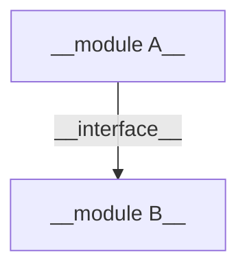
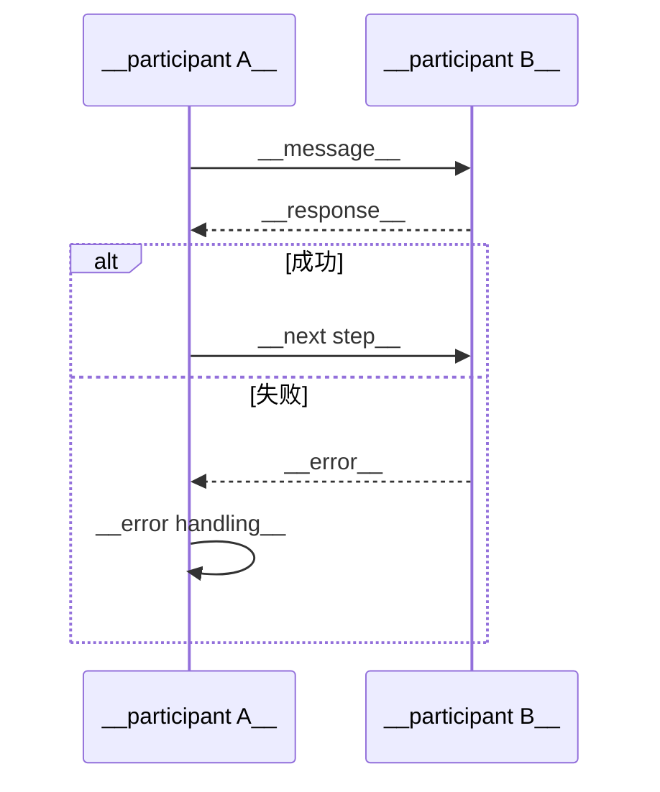
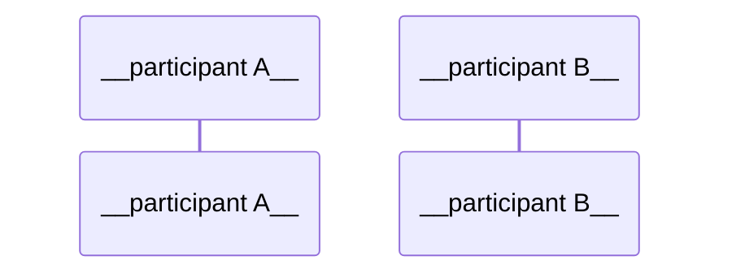
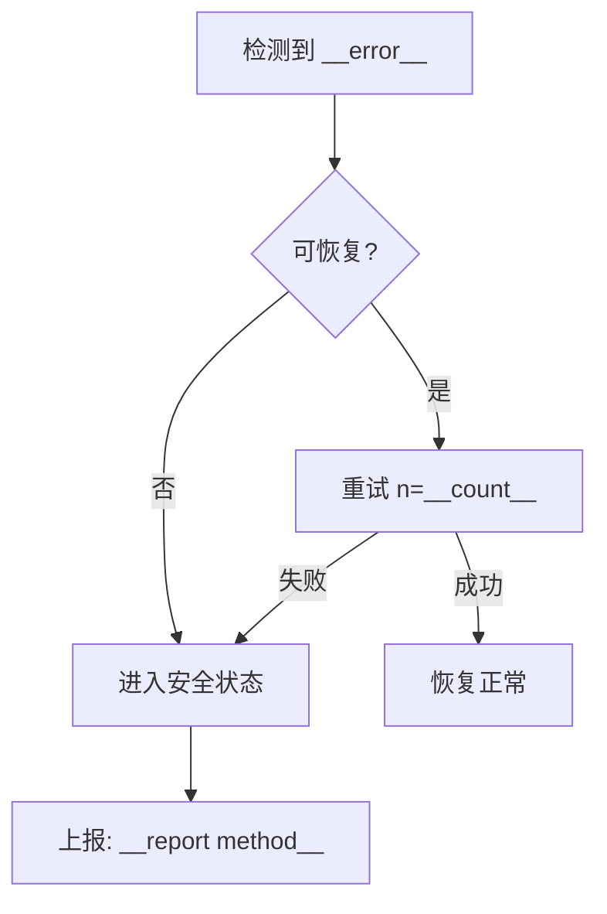

# {{TITLE}} — 高层设计 (HLD)

> **版本**: {{VERSION}} | **作者**: {{AUTHOR}} | **日期**: {{DATE}} | **状态**: {{STATUS}}
> **评审人**: {{REVIEWERS}} | **批准人**: {{APPROVER}}

## 1. 概述

### 1.1 目标

{{2-3 sentences: what problem this system solves, key goals, success criteria}}

### 1.2 范围

**在范围内:**
- {{item}}

**不在范围内:**
- {{item}}

### 1.3 术语

| 术语 | 定义 |
|------|------|
| {{term}} | {{definition}} |

### 1.4 参考文档

| 文档 | 类型 | 版本 | 来源 | 说明 |
|------|------|------|------|------|
| {{name}} | {{HLD/LLD/Datasheet/Standard}} | {{version}} | {{path/URL/user provided}} | {{relevance}} |

## 2. 系统架构

### 2.1 模块框图



### 2.2 模块职责

| 模块 | 职责 | 依赖 | 所属团队/负责人 |
|------|------|------|-----------------|
| {{module name}} | {{one-line responsibility}} | {{dependencies}} | {{owner}} |

### 2.3 技术选型

| 决策点 | 方案 | 备选 | 选型理由 |
|--------|------|------|----------|
| {{RTOS / SoC / protocol}} | {{choice}} | {{alternatives}} | {{why}} |

### 2.4 部署拓扑

```
{{ASCII diagram or mermaid showing physical deployment: MCUs, sensors, actuators, external systems}}
```

## 3. 模块接口

### 3.1 通信矩阵

| 接口 | 类型 | 物理层 | 协议 | 带宽 | 延迟要求 | 方向 |
|------|------|--------|------|------|----------|------|
| {{name}} | {{UART/I2C/SPI/CAN/BLE/etc.}} | {{physical}} | {{protocol}} | {{bps}} | {{max latency}} | A→B |

### 3.2 消息定义

{{For each interface:}}

**{{interface name}}**

| 消息 | ID | 方向 | 触发条件 | 数据格式 | 频率 | 最大长度 |
|------|-----|------|----------|----------|------|----------|
| {{message}} | {{id}} | A→B | {{when}} | {{format}} | {{Hz}} | {{bytes}} |

### 3.3 数据结构

```c
// {{structure name}} — {{purpose}}
typedef struct {
    {{type}} {{field}};  // {{description, range, unit}}
} {{name}};
```

### 3.4 接口版本管理

| 接口 | 当前版本 | 版本协商机制 | 向后兼容策略 |
|------|----------|-------------|-------------|
| {{interface}} | {{version}} | {{negotiation method}} | {{compatibility strategy}} |

## 4. 关键流程

### 4.1 {{flow name}}



### 4.2 {{flow name 2}}



## 5. 错误处理策略

### 5.1 错误分类

| 类别 | 示例 | 严重等级 | 处理策略 | 上报机制 |
|------|------|----------|----------|----------|
| 通信错误 | CRC failure, timeout | {{critical/error/warning}} | {{retry N times, then alert}} | {{log/event/GPIO}} |
| 数据错误 | Out-of-range, invalid state | {{level}} | {{action}} | {{method}} |
| 硬件故障 | Sensor dead, short circuit | {{level}} | {{safe state}} | {{method}} |
| 资源耗尽 | OOM, queue full | {{level}} | {{backpressure/degrade}} | {{method}} |

### 5.2 关键异常处理流程

**{{error scenario}}:**



### 5.3 看门狗与恢复

- **看门狗策略**: {{hardware/software watchdog, kick interval, timeout}}
- **故障恢复等级**:
  - L1: {{retry within module, no impact}}
  - L2: {{module restart, brief service loss}}
  - L3: {{system restart, full recovery sequence}}
- **降级模式**: {{what features are sacrificed when resources are constrained}}

## 6. 兼容性设计

### 6.1 协议兼容性

| 协议 | 版本 | 向前兼容 (新固件读旧数据) | 向后兼容 (旧固件读新数据) |
|------|------|-------------------------|-------------------------|
| {{protocol}} | {{version}} | {{strategy}} | {{strategy}} |

### 6.2 固件升级兼容性

- **升级方式**: {{OTA / 有线 / 双区备份}}
- **版本回滚策略**: {{是否支持, 回滚条件, 数据迁移}}
- **配置迁移**: {{旧版本配置如何迁移到新版本}}

### 6.3 硬件兼容性

| 硬件版本 | 支持的固件版本 | 接口差异 | 兼容性处理 |
|----------|---------------|----------|-----------|
| {{hw rev}} | {{fw versions}} | {{differences}} | {{how}} |

### 6.4 扩展预留

| 位置 | 预留方式 | 用途 |
|------|----------|------|
| {{message/struct/interface}} | {{reserved fields / version byte / length prefix}} | {{future use case}} |

## 7. 资源预算

### 7.1 存储预算

| 模块 | Flash (KB) | RAM (KB) | EEPROM/NVM (KB) | 备注 |
|------|-----------|----------|-----------------|------|
| {{module}} | {{size}} | {{size}} | {{size}} | {{note}} |
| **总计** | **{{total}}** | **{{total}}** | **{{total}}** | **SoC 总容量: {{spec}}** |

### 7.2 CPU 预算

| 任务 | 周期 | WCET | CPU 占用率 | 峰值占用 |
|------|------|------|-----------|----------|
| {{task}} | {{period}} | {{wcet}} | {{percent}}% | {{percent}}% |
| **总计** | | | **{{total}}%** | **{{total}}%** |

### 7.3 功耗预算

| 模式 | 电流 (mA) | 持续时长 | 备注 |
|------|----------|----------|------|
| 正常运行 | {{mA}} | — | |
| 低功耗 | {{mA}} | {{duration}} | |
| 休眠 | {{μA}} | {{duration}} | |
| **平均功耗** | **{{mA}}** | | **预算: {{budget}}** |

### 7.4 外设资源

| 外设 | 用途 | 占用模块 | 冲突风险 |
|------|------|----------|----------|
| {{UART1 / SPI2 / Timer3}} | {{purpose}} | {{module}} | {{conflict notes}} |

## 8. 风险评估

### 8.1 技术风险

| 风险 | 影响 | 概率 | 风险等级 | 缓解措施 | 应急预案 |
|------|------|------|----------|----------|----------|
| {{risk}} | {{impact}} | {{high/med/low}} | {{level}} | {{mitigation}} | {{fallback}} |

### 8.2 依赖风险

| 依赖项 | 依赖方 | 风险 | 影响 | 缓解措施 |
|--------|--------|------|------|----------|
| {{external module, third-party lib, supplier}} | {{who depends}} | {{risk}} | {{impact}} | {{mitigation}} |

### 8.3 可靠性分析

- **MTBF 目标**: {{hours}}
- **单点故障分析**: {{SPOF list and mitigation}}
- **FMEA 摘要**: {{key failure modes identified}}

## 9. 测试策略

### 9.1 测试层级

| 层级 | 范围 | 方法 | 覆盖目标 | 工具 |
|------|------|------|----------|------|
| 单元测试 | {{module scope}} | {{method}} | {{coverage %}} | {{tool}} |
| 集成测试 | {{integration scope}} | {{method}} | {{target}} | {{tool}} |
| 系统测试 | {{system scope}} | {{method}} | {{target}} | {{tool}} |
| HIL 测试 | {{HIL scope}} | {{method}} | {{target}} | {{tool}} |

### 9.2 关键测试场景

| 场景 | 前置条件 | 操作步骤 | 预期结果 | 优先级 |
|------|----------|----------|----------|--------|
| {{scenario}} | {{precondition}} | {{steps}} | {{expected}} | {{P0/P1/P2}} |

### 9.3 异常测试

| 异常场景 | 注入方式 | 预期行为 | 恢复验证 |
|----------|----------|----------|----------|
| {{fault}} | {{injection method}} | {{expected behavior}} | {{how to verify recovery}} |

### 9.4 需求追溯矩阵

| 需求ID | 需求描述 | 对应设计章节 | 验证测试 | 状态 |
|--------|----------|-------------|----------|------|
| {{REQ-xxx}} | {{description}} | {{section}} | {{test case ID}} | {{covered/gap}} |
