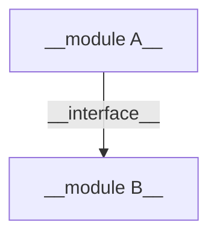
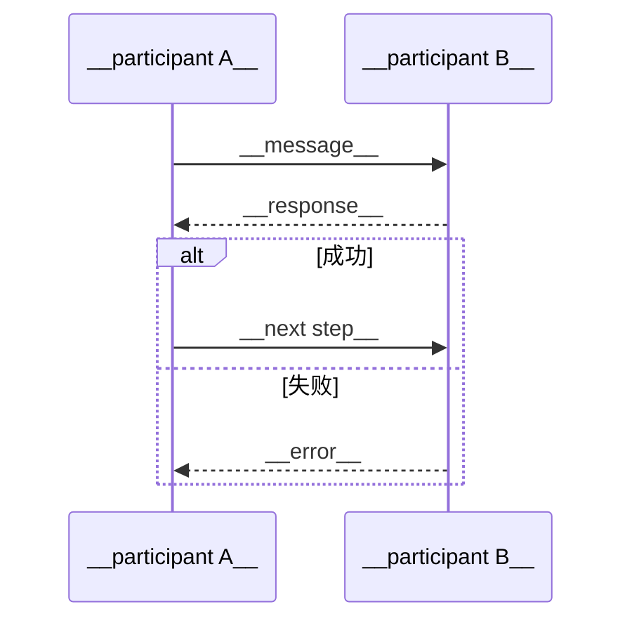
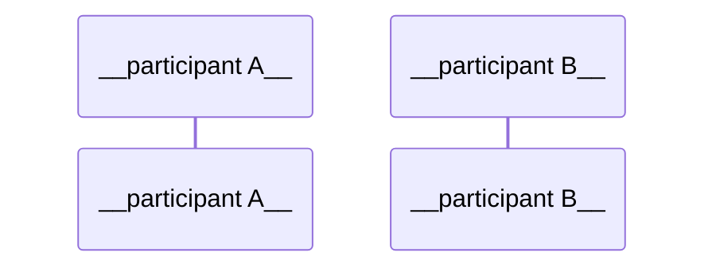
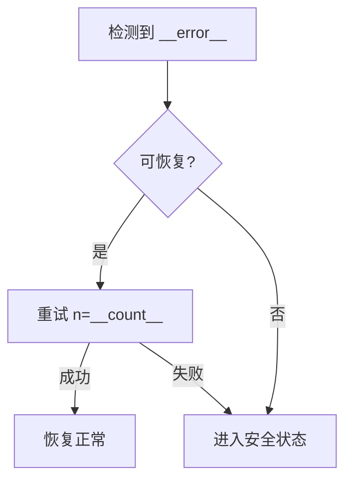

# {{TITLE}} — 高层设计 (HLD)

> **版本**: {{VERSION}} | **作者**: {{AUTHOR}} | **日期**: {{DATE}} | **状态**: {{STATUS}}

## 1. 概述

### 1.1 目标

{{2-3 sentences: what problem this system solves, key goals}}

### 1.2 范围

**在范围内:**
- {{item}}

**不在范围内:**
- {{item}}

### 1.3 术语

| 术语 | 定义 |
|------|------|
| {{term}} | {{definition}} |

### 1.4 参考文档

| 文档 | 类型 | 来源 | 说明 |
|------|------|------|------|
| {{name}} | {{HLD/LLD/Datasheet/Ref}} | {{path or URL}} | {{relevance}} |

## 2. 系统架构

### 2.1 模块框图



### 2.2 模块职责

| 模块 | 职责 | 依赖 |
|------|------|------|
| {{module name}} | {{one-line responsibility}} | {{dependencies}} |

## 3. 模块接口

### 3.1 通信方式

| 接口 | 类型 | 物理层 | 协议 | 方向 |
|------|------|--------|------|------|
| {{name}} | {{UART/I2C/SPI/CAN/etc.}} | {{physical}} | {{protocol}} | A→B |

### 3.2 消息定义

{{For each interface:}}

**{{interface name}}**

| 消息 | 方向 | 触发条件 | 数据格式 | 频率 |
|------|------|----------|----------|------|
| {{message name}} | A→B | {{when}} | {{format or ref}} | {{Hz/on-demand}} |

### 3.3 数据结构

```c
// {{structure name}} — {{purpose}}
typedef struct {
    {{type}} {{field}};  // {{description, range}}
} {{name}};
```

## 4. 关键流程

### 4.1 {{flow name}}



### 4.2 {{flow name 2 (if needed)}}



## 5. 错误处理策略

### 5.1 错误分类

| 类别 | 示例 | 处理策略 |
|------|------|----------|
| 通信错误 | CRC failure, timeout | {{retry N times, then alert}} |
| 数据错误 | Out-of-range value, invalid state | {{log, use default, reject}} |
| 硬件故障 | Sensor dead, short circuit | {{safe state, report}} |
| 资源耗尽 | OOM, queue full | {{backpressure, graceful degradation}} |

### 5.2 关键异常处理流程

**{{error scenario}}:**



### 5.3 看门狗与恢复

- **看门狗策略**: {{hardware/software watchdog, kick interval, timeout}}
- **故障恢复**: {{restart sequence, state restoration, graceful degradation}}
