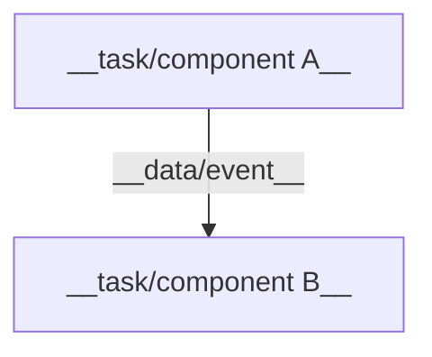
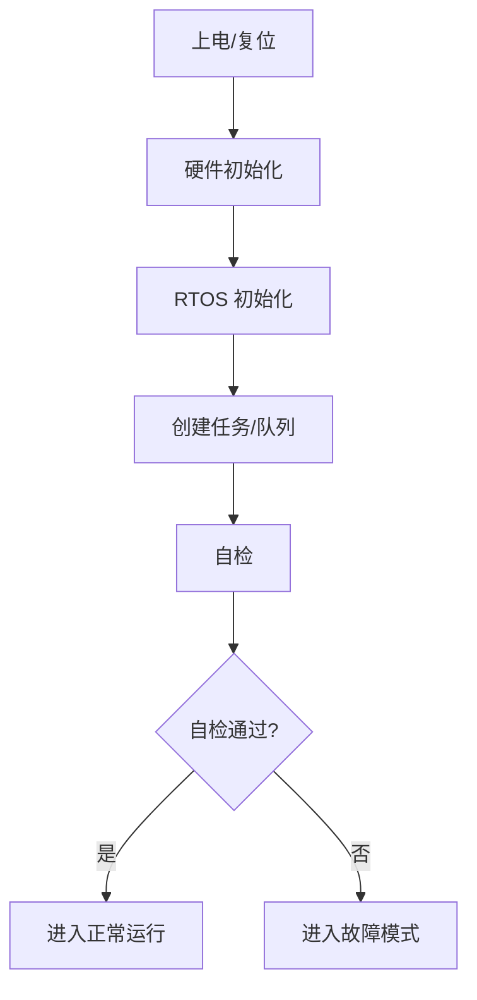
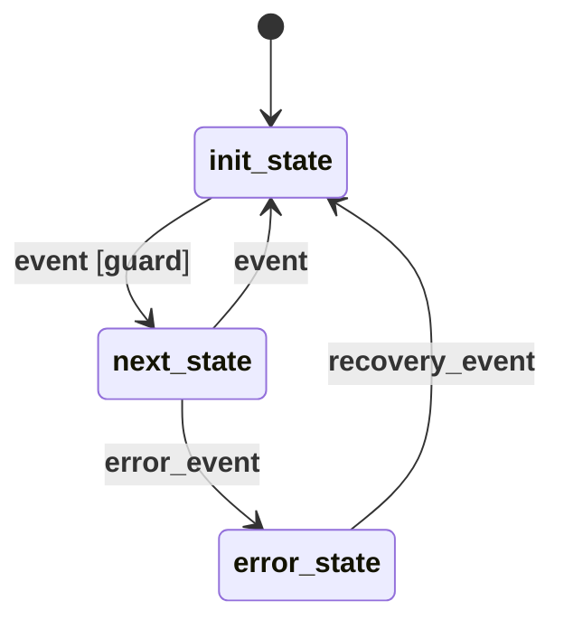
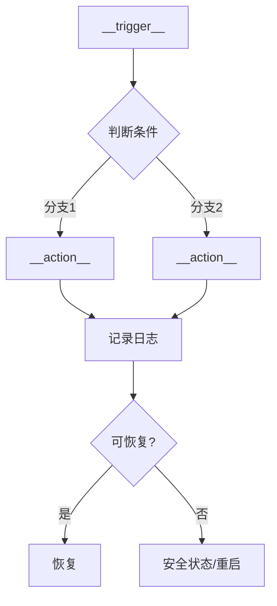
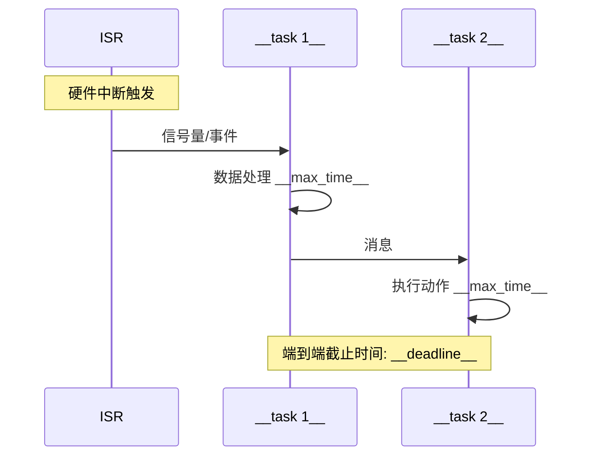

# {{TITLE}} — 详细设计 (LLD)

> **版本**: {{VERSION}} | **作者**: {{AUTHOR}} | **日期**: {{DATE}} | **状态**: {{STATUS}}
> **关联 HLD**: {{HLD reference}} | **评审人**: {{REVIEWERS}}

## 1. 概述

### 1.1 目标

{{1-2 sentences: what this module does, its role in the system}}

### 1.2 范围

**在范围内:**
- {{item}}

**不在范围内:**
- {{item}}

### 1.3 术语

| 术语 | 定义 |
|------|------|
| {{term}} | {{definition}} |

### 1.4 参考文档

| 文档 | 类型 | 版本 | 来源 | 说明 |
|------|------|------|------|------|
| {{name}} | {{HLD/LLD/Datasheet/Standard}} | {{version}} | {{path/URL/user provided}} | {{relevance}} |

## 2. 内部结构

### 2.1 组件/任务框图



### 2.2 组件职责

| 组件/任务 | 类型 | 优先级 | 栈大小 | 职责 |
|-----------|------|--------|--------|------|
| {{name}} | {{task/ISR/timer}} | {{priority}} | {{bytes}} | {{one-line}} |

### 2.3 启动与初始化



**初始化顺序依赖:**
| 步骤 | 依赖 | 超时 | 失败处理 |
|------|------|------|----------|
| {{step}} | {{depends on}} | {{timeout}} | {{handler}} |

## 3. 接口详细定义

### 3.1 函数接口

```c
/**
 * {{brief description}}
 * @param {{name}}  {{description, range, constraints}}
 * @return {{description, error codes}}
 * @pre  {{precondition}}
 * @post {{side effect}}
 * @thread-safety {{thread-safe / not thread-safe / reentrant}}
 * @context {{task / ISR / either}}
 */
{{return_type}} {{function_name}}({{params}});
```

### 3.2 数据结构

```c
// {{structure name}} — {{purpose}}
// 持久化: {{yes/no, storage location}}
// 对齐: {{alignment requirement}}
typedef struct {
    {{type}} {{field}};  // {{description, valid range, unit}}
    {{type}} _reserved;  // 预留，未来扩展
} {{name}};
```

### 3.3 消息/事件定义

| 消息/事件 | ID | 发送方 | 接收方 | 数据载荷 | 优先级 | 队列 |
|-----------|-----|--------|--------|----------|--------|------|
| {{name}} | {{id}} | {{sender}} | {{receiver}} | {{payload fields}} | {{priority}} | {{queue name}} |

### 3.4 配置参数

| 参数 | 类型 | 默认值 | 范围 | 持久化 | 运行时可改 | 说明 |
|------|------|--------|------|--------|-----------|------|
| {{name}} | {{type}} | {{default}} | {{min–max}} | {{yes/no}} | {{yes/no}} | {{description}} |

### 3.5 接口契约

| 接口 | 前置条件 | 后置条件 | 不变量 | 性能承诺 |
|------|----------|----------|--------|----------|
| {{function/API}} | {{precondition}} | {{postcondition}} | {{invariant}} | {{latency/throughput}} |

## 4. 核心逻辑

### 4.1 状态机



**状态说明:**

| 状态 | 描述 | 进入动作 | 退出动作 | 最大停留时间 |
|------|------|----------|----------|-------------|
| {{state}} | {{what it means}} | {{action on entry}} | {{action on exit}} | {{timeout}} |

**状态转换表:**

| 当前状态 | 事件 | 守卫条件 | 下一状态 | 动作 | 超时 |
|----------|------|----------|----------|------|------|
| {{current}} | {{event}} | {{guard}} | {{next}} | {{action}} | {{timeout}} |

### 4.2 核心算法

```c
// {{algorithm name}}
// 时间复杂度: {{O(n)}}  |  空间复杂度: {{O(1)}}
// 引用: {{standard/paper/reference}}
{{pseudocode or key code snippet}}
```

**边界条件:**
| 边界 | 输入 | 预期输出 | 处理方式 |
|------|------|----------|----------|
| {{boundary}} | {{input}} | {{expected}} | {{method}} |

**数值精度:**
| 计算 | 精度要求 | 舍入策略 | 溢出处理 |
|------|----------|----------|----------|
| {{computation}} | {{precision}} | {{rounding}} | {{overflow handling}} |

### 4.3 时序约束

| 操作 | WCET (min/typ/max) | 截止时间 | 周期 | 抖动容限 |
|------|--------------------|----------|------|----------|
| {{operation}} | {{min}}/{{typ}}/{{max}} | {{deadline}} | {{period}} | {{jitter tolerance}} |

### 4.4 并发与同步

| 共享资源 | 访问者 | 同步机制 | 最大持锁时间 | 死锁预防 |
|----------|--------|----------|-------------|----------|
| {{resource}} | {{tasks/ISRs}} | {{mutex/semaphore/spinlock}} | {{max time}} | {{strategy}} |

**临界区分析:**
| 临界区 | 最长执行时间 | 是否可抢占 | 嵌套情况 |
|--------|-------------|-----------|----------|
| {{section}} | {{time}} | {{yes/no}} | {{nesting}} |

## 5. 异常处理

### 5.1 错误码表

| 错误码 | 名称 | 触发条件 | 严重等级 | 处理方式 | 恢复策略 | 上报路径 |
|--------|------|----------|----------|----------|----------|----------|
| {{code}} | {{name}} | {{condition}} | {{level}} | {{handler}} | {{recovery}} | {{reporting}} |

### 5.2 异常处理流程

**{{error scenario}}:**



### 5.3 断言与防御性编程

| 断言位置 | 条件 | 触发后动作 | 生产构建行为 |
|----------|------|-----------|-------------|
| {{function/file:line}} | {{assert condition}} | {{log + reset / hang / notify}} | {{behavior in release}} |

### 5.4 看门狗与监控

- **任务监控**: {{heartbeat mechanism, timeout, action on hang, max consecutive misses}}
- **栈监控**: {{watermark check method, threshold (% used), action on overflow}}
- **堆监控**: {{allocation tracking, max heap usage, fragmentation strategy}}
- **队列监控**: {{max depth, overflow strategy, backpressure mechanism}}

## 6. 兼容性设计

### 6.1 数据结构兼容性

| 结构体 | 版本 | 向后兼容 (旧代码读新数据) | 向前兼容 (新代码读旧数据) |
|--------|------|-------------------------|-------------------------|
| {{struct}} | {{version}} | {{strategy}} | {{strategy}} |

**版本演进规则:**
- 新增字段仅追加到末尾或 `_reserved` 区域
- 禁止修改已有字段类型或顺序
- 结构体版本号在首字段或包头中

### 6.2 接口兼容性

| 接口/API | 版本 | 废弃计划 | 迁移路径 |
|----------|------|----------|----------|
| {{api}} | {{version}} | {{deprecation timeline}} | {{migration guide}} |

### 6.3 配置兼容性

- **配置迁移策略**: {{如何从旧版本配置升级}}
- **未知配置处理**: {{遇到未知配置项时的行为 (忽略/报错/默认值)}}
- **配置版本号**: {{存储位置, 校验方式}}

### 6.4 扩展预留

| 组件 | 预留机制 | 当前使用 | 扩展能力 |
|------|----------|----------|----------|
| {{component}} | {{reserved fields / config slots / ID ranges}} | {{current usage}} | {{what can be added}} |

## 7. 资源预算

### 7.1 存储预算

| 资源 | Flash (bytes) | RAM (bytes) | 备注 |
|------|-------------|------------|------|
| 代码 (.text) | {{size}} | — | |
| 常量 (.rodata) | {{size}} | — | |
| 已初始化数据 (.data) | {{size}} | {{size}} | Flash + RAM |
| 未初始化数据 (.bss) | — | {{size}} | |
| 堆 | — | {{size}} | |
| 栈 (per task) | — | {{size}} × {{N}} | |
| **总计** | **{{total}}** | **{{total}}** | **预算: {{budget}} / {{budget}}** |

### 7.2 CPU 预算

| 任务/ISR | 周期/频率 | WCET | 平均执行时间 | CPU 占用 | 备注 |
|-----------|----------|------|-------------|----------|------|
| {{task}} | {{period}} | {{wcet}} | {{avg}} | {{percent}}% | {{note}} |
| **总计** | | | | **{{total}}%** | |

### 7.3 功耗估算

| 外设/模块 | 工作时功耗 (mA) | 空闲时功耗 (mA) | 占空比 | 平均功耗 (mA) |
|-----------|----------------|----------------|--------|---------------|
| {{peripheral}} | {{active}} | {{idle}} | {{duty}}% | {{avg}} |

### 7.4 外设资源占用

| 外设 | 模式 | 引脚 | DMA 通道 | 中断优先级 | 共享情况 |
|------|------|------|----------|-----------|----------|
| {{peripheral}} | {{mode}} | {{pins}} | {{DMA channel}} | {{IRQ pri}} | {{shared with}} |

## 8. 详细时序

### 8.1 关键路径时序图



### 8.2 任务调度时序

```
{{ASCII timing diagram showing task scheduling over one major cycle}}
时间轴 →
Task1:  [===RUN===][---IDLE---][===RUN===][---IDLE---]
Task2:  [---IDLE---][===RUN===][---IDLE---][===RUN===]
ISR:    [R][R] [R]  [R]   [R][R] [R]  [R]
```

### 8.3 关键延迟路径分析

| 路径 | 起点 | 终点 | 典型延迟 | 最坏延迟 | 截止时间 | 裕量 |
|------|------|------|----------|----------|----------|------|
| {{path name}} | {{trigger}} | {{response}} | {{typical}} | {{worst}} | {{deadline}} | {{margin}} |

## 9. 风险评估

### 9.1 技术风险

| 风险 | 影响 | 概率 | 风险等级 | 缓解措施 | 应急预案 | 残留风险 |
|------|------|------|----------|----------|----------|----------|
| {{risk}} | {{impact}} | {{H/M/L}} | {{level}} | {{mitigation}} | {{fallback}} | {{residual}} |

### 9.2 并发风险

| 风险 | 竞态条件描述 | 发生场景 | 缓解措施 |
|------|-------------|----------|----------|
| 死锁 | {{deadlock scenario}} | {{trigger}} | {{prevention}} |
| 优先级反转 | {{inversion scenario}} | {{trigger}} | {{prevention}} |
| 活锁 | {{livelock scenario}} | {{trigger}} | {{prevention}} |

### 9.3 资源耗尽风险

| 资源 | 峰值需求 | 容量 | 安全裕量 (%) | 耗尽后果 | 监控方式 |
|------|----------|------|-------------|----------|----------|
| {{resource}} | {{peak}} | {{capacity}} | {{margin}}% | {{consequence}} | {{monitoring}} |

## 10. 测试指导

### 10.1 单元测试

| 被测函数/模块 | 测试方法 | 桩/驱动需求 | 覆盖目标 | 关键用例 |
|---------------|----------|-------------|----------|----------|
| {{function}} | {{method}} | {{stubs/drivers}} | {{branch/line %}} | {{key cases}} |

### 10.2 集成测试

| 集成接口 | 测试策略 | 环境 | 关键场景 | 通过标准 |
|----------|----------|------|----------|----------|
| {{interface}} | {{strategy}} | {{env}} | {{scenarios}} | {{criteria}} |

### 10.3 故障注入测试

| 故障类型 | 注入点 | 注入方法 | 预期行为 | 恢复验证 |
|----------|--------|----------|----------|----------|
| {{fault}} | {{location}} | {{method}} | {{expected}} | {{recovery check}} |

### 10.4 压力测试

| 测试场景 | 条件 | 持续时间 | 成功指标 |
|----------|------|----------|----------|
| {{scenario}} | {{condition (max rate, min memory, etc.)}} | {{duration}} | {{metrics (no crash, no leak, latency < X)}} |

### 10.5 回归测试

- **回归测试套件**: {{suite location, run frequency}}
- **持续集成**: {{CI pipeline, triggers, notification}}
- **已知问题回归清单**: {{link to known issues that must be re-tested}}

### 10.6 需求追溯矩阵

| 需求ID | 需求描述 | 对应函数/模块 | 单元测试 | 集成测试 | 状态 |
|--------|----------|-------------|----------|----------|------|
| {{REQ-xxx}} | {{description}} | {{function/module}} | {{test case}} | {{test case}} | {{covered/gap}} |
