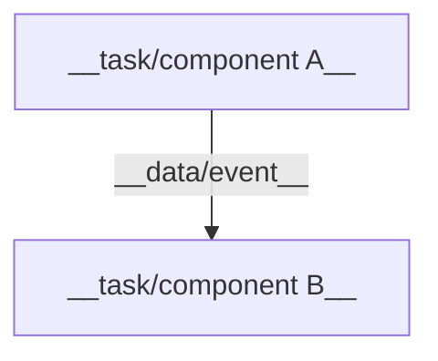
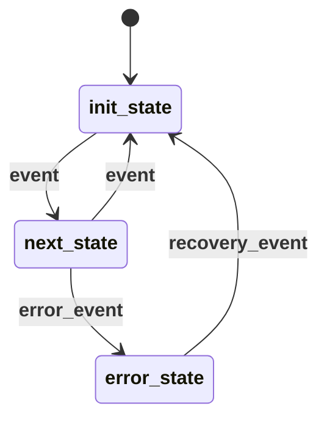
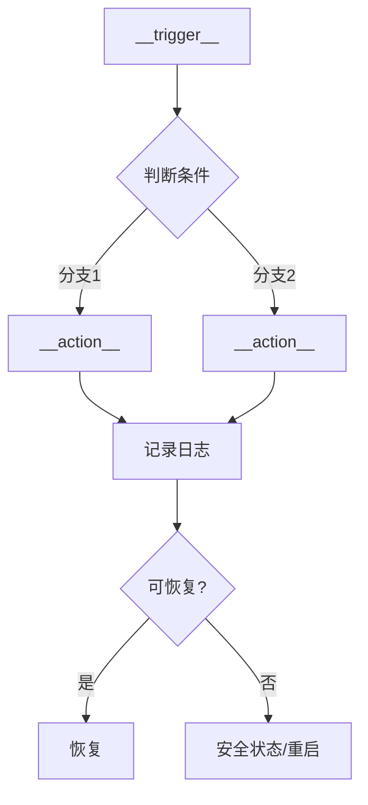

# {{TITLE}} — 详细设计 (LLD)

> **版本**: {{VERSION}} | **作者**: {{AUTHOR}} | **日期**: {{DATE}} | **状态**: {{STATUS}}
> **关联 HLD**: {{HLD reference}}

## 1. 概述

### 1.1 目标

{{1-2 sentences: what this module does, its role in the system}}

### 1.2 范围

**在范围内:**
- {{item}}

**不在范围内:**
- {{item}}

### 1.3 术语

| 术语 | 定义 |
|------|------|
| {{term}} | {{definition}} |

### 1.4 参考文档

| 文档 | 类型 | 来源 | 说明 |
|------|------|------|------|
| {{name}} | {{HLD/LLD/Datasheet/Ref}} | {{path or URL}} | {{relevance}} |

## 2. 内部结构

### 2.1 组件/任务框图



### 2.2 组件职责

| 组件/任务 | 类型 | 优先级 | 栈大小 | 职责 |
|-----------|------|--------|--------|------|
| {{name}} | {{task/ISR/timer}} | {{priority}} | {{bytes}} | {{one-line}} |

## 3. 接口详细定义

### 3.1 函数接口

```c
/**
 * {{brief description}}
 * @param {{name}}  {{description, range, constraints}}
 * @return {{description, error codes}}
 * @pre  {{precondition}}
 * @post {{side effect}}
 */
{{return_type}} {{function_name}}({{params}});
```

### 3.2 数据结构

```c
// {{structure name}} — {{purpose}}
typedef struct {
    {{type}} {{field}};  // {{description, valid range}}
} {{name}};
```

### 3.3 消息/事件定义

| 消息/事件 | ID | 发送方 | 接收方 | 数据载荷 | 优先级 |
|-----------|-----|--------|--------|----------|--------|
| {{name}} | {{id}} | {{sender}} | {{receiver}} | {{payload fields}} | {{priority}} |

### 3.4 配置参数

| 参数 | 类型 | 默认值 | 范围 | 说明 |
|------|------|--------|------|------|
| {{name}} | {{type}} | {{default}} | {{min–max}} | {{description}} |

## 4. 核心逻辑

### 4.1 状态机



**状态说明:**

| 状态 | 描述 | 进入动作 | 退出动作 |
|------|------|----------|----------|
| {{state}} | {{what it means}} | {{action on entry}} | {{action on exit}} |

**状态转换表:**

| 当前状态 | 事件 | 下一状态 | 动作 | 超时 |
|----------|------|----------|------|------|
| {{current}} | {{event}} | {{next}} | {{action}} | {{timeout if any}} |

### 4.2 核心算法

```c
// {{algorithm name}}
// 时间复杂度: {{O(n)}}  |  空间复杂度: {{O(1)}}
{{pseudocode or key code snippet}}
```

**边界条件:**
- {{edge case 1}} → {{behavior}}
- {{edge case 2}} → {{behavior}}

### 4.3 时序约束

| 操作 | 最坏执行时间 | 截止时间 | 周期 |
|------|-------------|----------|------|
| {{operation}} | {{WCET}} | {{deadline}} | {{period}} |

## 5. 异常处理

### 5.1 错误码表

| 错误码 | 名称 | 触发条件 | 处理方式 | 恢复策略 |
|--------|------|----------|----------|----------|
| {{code}} | {{name}} | {{condition}} | {{handler}} | {{recovery}} |

### 5.2 异常处理流程

**{{error scenario}}:**



### 5.3 看门狗与监控

- **任务监控**: {{heartbeat mechanism, timeout, action on hang}}
- **资源监控**: {{stack watermark, heap usage, queue depth}}
- **断言策略**: {{when to assert, what to log before assert}}
