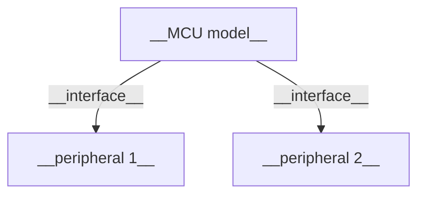
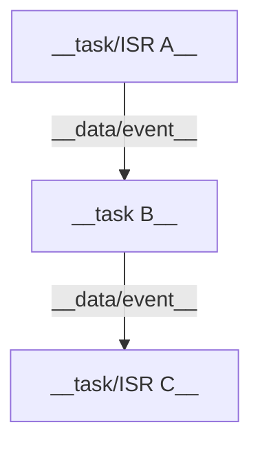
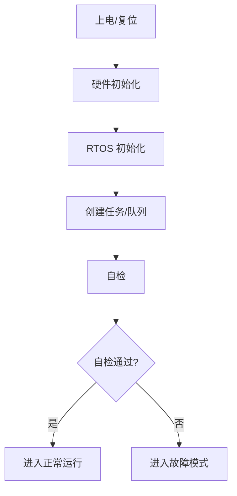
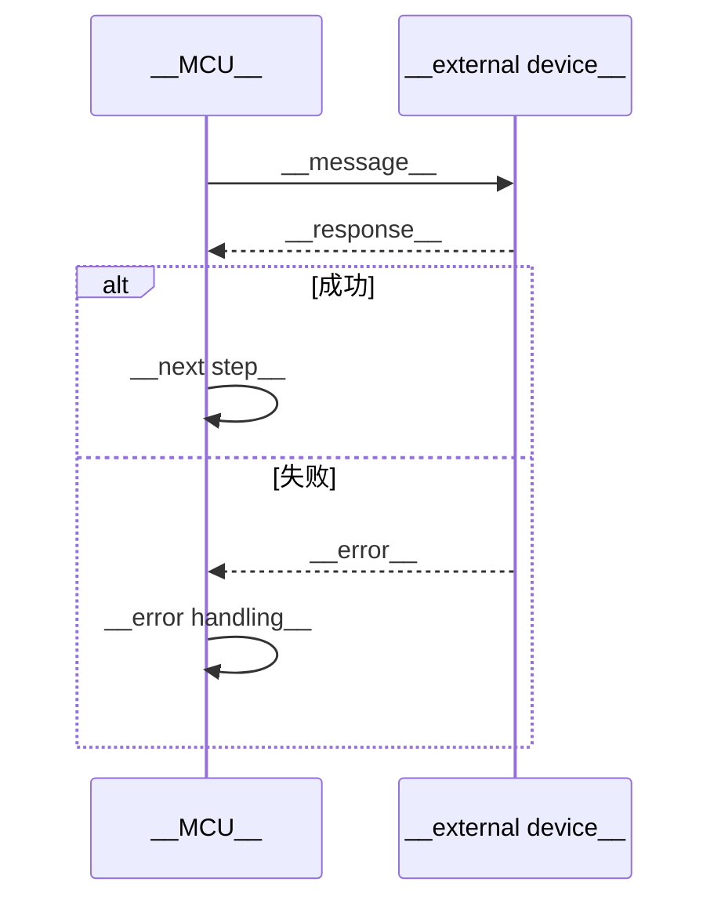
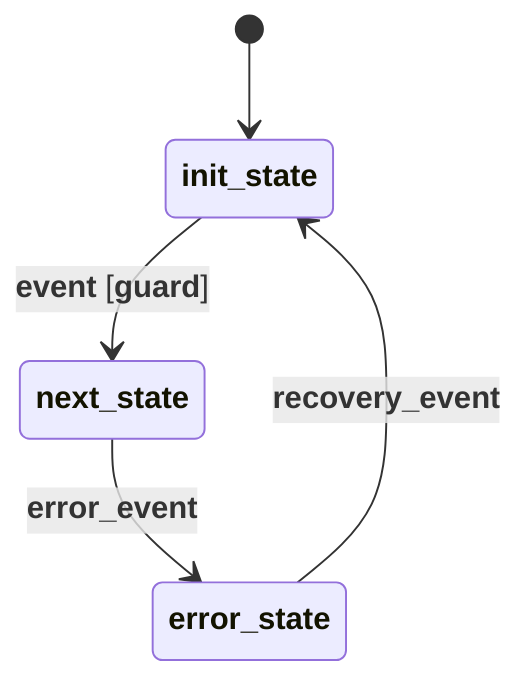
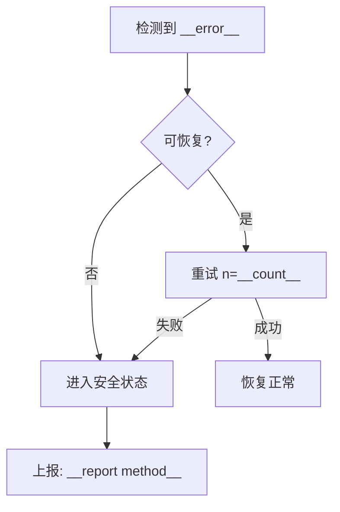
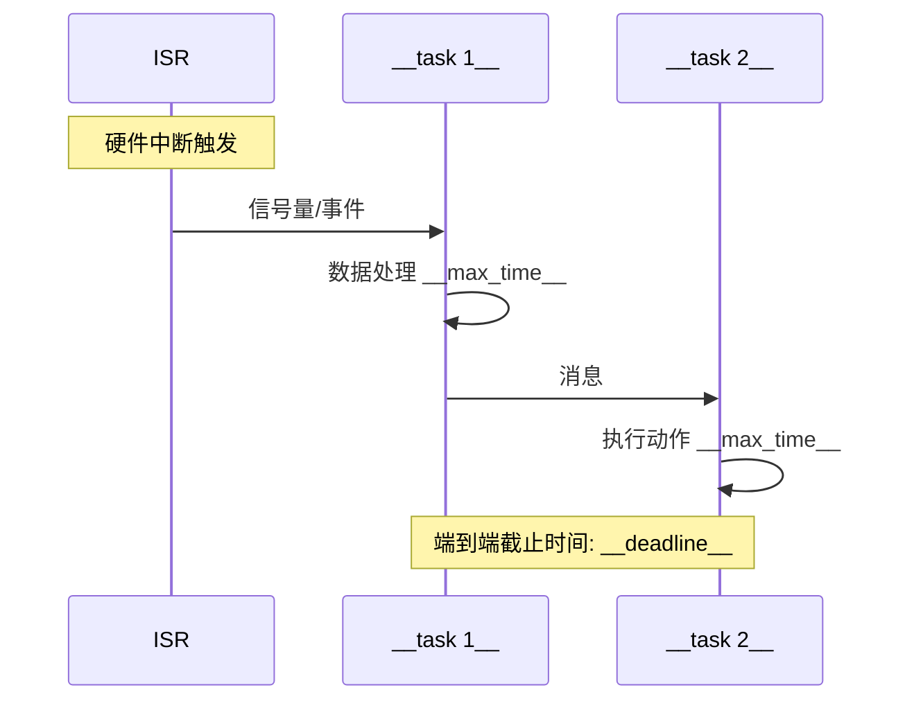

# {{TITLE}} — 嵌入式软件设计

> **版本**: {{VERSION}} | **作者**: {{AUTHOR}} | **日期**: {{DATE}} | **状态**: {{STATUS}}
> **评审人**: {{REVIEWERS}} | **批准人**: {{APPROVER}}

## 1. 概述

### 1.1 目标

{{2-3 sentences: what this embedded software does, key goals, success criteria}}

### 1.2 范围

**在范围内:**
- {{item}}

**不在范围内:**
- {{item}}

### 1.3 术语

| 术语 | 定义 |
|------|------|
| {{term}} | {{definition}} |

### 1.4 参考文档

| 文档 | 类型 | 版本 | 来源 | 说明 |
|------|------|------|------|------|
| {{name}} | {{HLD/LLD/Datasheet/Standard}} | {{version}} | {{path/URL/user provided}} | {{relevance}} |

## 2. 系统架构

### 2.1 硬件框图



| 外设/器件 | 型号 | 接口 | 引脚 | 用途 |
|-----------|------|------|------|------|
| {{name}} | {{model}} | {{UART/I2C/SPI/GPIO}} | {{pins}} | {{purpose}} |

### 2.2 软件架构



### 2.3 组件职责

| 组件/任务 | 类型 | 优先级 | 栈大小 | 职责 | 依赖 | 负责人 |
|-----------|------|--------|--------|------|------|--------|
| {{name}} | {{task/ISR}} | {{priority}} | {{bytes}} | {{one-line}} | {{dependencies}} | {{owner}} |

### 2.4 技术选型

| 决策点 | 方案 | 备选 | 选型理由 |
|--------|------|------|----------|
| {{RTOS / SoC / protocol / library}} | {{choice}} | {{alternatives}} | {{why}} |

### 2.5 启动与初始化



| 步骤 | 依赖 | 超时 | 失败处理 |
|------|------|------|----------|
| {{step}} | {{depends on}} | {{timeout}} | {{handler}} |

## 3. 接口设计

### 3.1 外部接口

| 接口 | 类型 | 物理层 | 协议 | 带宽 | 延迟要求 | 方向 |
|------|------|--------|------|------|----------|------|
| {{name}} | {{UART/I2C/SPI/CAN/BLE/etc.}} | {{physical}} | {{protocol}} | {{bps}} | {{max latency}} | MCU↔{{device}} |

**{{interface name}} 消息定义:**

| 消息 | ID | 方向 | 触发条件 | 数据格式 | 频率 | 最大长度 |
|------|-----|------|----------|----------|------|----------|
| {{message}} | {{id}} | MCU→{{dev}} | {{when}} | {{format}} | {{Hz}} | {{bytes}} |

### 3.2 内部接口

| 接口 | 类型 | 发送方 | 接收方 | 数据载荷 | 优先级 | 队列 | 同步机制 |
|------|------|--------|--------|----------|--------|------|----------|
| {{name}} | {{queue/mailbox/event}} | {{sender}} | {{receiver}} | {{payload}} | {{priority}} | {{queue}} | {{mutex/semaphore}} |

### 3.3 关键函数接口

```c
/**
 * {{brief description}}
 * @param {{name}}  {{description, range, constraints}}
 * @return {{description, error codes}}
 * @pre  {{precondition}}
 * @post {{side effect}}
 * @thread-safety {{thread-safe / not thread-safe / reentrant}}
 * @context {{task / ISR / either}}
 */
{{return_type}} {{function_name}}({{params}});
```

### 3.4 接口契约

| 接口 | 前置条件 | 后置条件 | 不变量 | 性能承诺 |
|------|----------|----------|--------|----------|
| {{function/API}} | {{precondition}} | {{postcondition}} | {{invariant}} | {{latency/throughput}} |

### 3.5 数据结构

```c
// {{structure name}} — {{purpose}}
// 持久化: {{yes/no, storage location}}
// 对齐: {{alignment requirement}}
typedef struct {
    {{type}} {{field}};  // {{description, valid range, unit}}
    {{type}} _reserved;  // 预留，未来扩展
} {{name}};
```

### 3.6 配置参数

| 参数 | 类型 | 默认值 | 范围 | 持久化 | 运行时可改 | 说明 |
|------|------|--------|------|--------|-----------|------|
| {{name}} | {{type}} | {{default}} | {{min–max}} | {{yes/no}} | {{yes/no}} | {{description}} |

### 3.7 接口版本管理

| 接口 | 当前版本 | 版本协商机制 | 向后兼容策略 |
|------|----------|-------------|-------------|
| {{interface}} | {{version}} | {{negotiation method}} | {{compatibility strategy}} |

## 4. 核心流程与逻辑

### 4.1 关键流程



### 4.2 状态机



| 状态 | 描述 | 进入动作 | 退出动作 | 最大停留时间 |
|------|------|----------|----------|-------------|
| {{state}} | {{meaning}} | {{entry action}} | {{exit action}} | {{timeout}} |

| 当前状态 | 事件 | 守卫条件 | 下一状态 | 动作 | 超时 |
|----------|------|----------|----------|------|------|
| {{current}} | {{event}} | {{guard}} | {{next}} | {{action}} | {{timeout}} |

### 4.3 核心算法

```c
// {{algorithm name}}
// 时间复杂度: {{O(n)}}  |  空间复杂度: {{O(1)}}
// 引用: {{standard/paper/reference}}
{{pseudocode or key code snippet}}
```

**边界条件:**

| 边界 | 输入 | 预期输出 | 处理方式 |
|------|------|----------|----------|
| {{boundary}} | {{input}} | {{expected}} | {{method}} |

**数值精度:**

| 计算 | 精度要求 | 舍入策略 | 溢出处理 |
|------|----------|----------|----------|
| {{computation}} | {{precision}} | {{rounding}} | {{overflow handling}} |

### 4.4 时序约束

| 操作 | WCET (min/typ/max) | 截止时间 | 周期 | 抖动容限 |
|------|--------------------|----------|------|----------|
| {{operation}} | {{min}}/{{typ}}/{{max}} | {{deadline}} | {{period}} | {{jitter tolerance}} |

### 4.5 并发与同步

| 共享资源 | 访问者 | 同步机制 | 最大持锁时间 | 死锁预防 |
|----------|--------|----------|-------------|----------|
| {{resource}} | {{tasks/ISRs}} | {{mutex/semaphore/spinlock}} | {{max time}} | {{strategy}} |

| 临界区 | 最长执行时间 | 是否可抢占 | 嵌套情况 |
|--------|-------------|-----------|----------|
| {{section}} | {{time}} | {{yes/no}} | {{nesting}} |

## 5. 异常处理

### 5.1 错误分类

| 类别 | 示例 | 严重等级 | 处理策略 | 上报机制 |
|------|------|----------|----------|----------|
| 通信错误 | CRC failure, timeout | {{critical/error/warning}} | {{retry N times, then alert}} | {{log/event/GPIO}} |
| 数据错误 | Out-of-range, invalid state | {{level}} | {{action}} | {{method}} |
| 硬件故障 | Sensor dead, short circuit | {{level}} | {{safe state}} | {{method}} |
| 资源耗尽 | OOM, queue full | {{level}} | {{backpressure/degrade}} | {{method}} |

### 5.2 错误码表

| 错误码 | 名称 | 触发条件 | 严重等级 | 处理方式 | 恢复策略 | 上报路径 |
|--------|------|----------|----------|----------|----------|----------|
| {{code}} | {{name}} | {{condition}} | {{level}} | {{handler}} | {{recovery}} | {{reporting}} |

### 5.3 异常处理流程



### 5.4 断言与防御性编程

| 断言位置 | 条件 | 触发后动作 | 生产构建行为 |
|----------|------|-----------|-------------|
| {{function/file:line}} | {{assert condition}} | {{log + reset / hang / notify}} | {{behavior in release}} |

### 5.5 看门狗与监控

- **看门狗策略**: {{hardware/software watchdog, kick interval, timeout}}
- **故障恢复等级**:
  - L1: {{retry within module, no impact}}
  - L2: {{module restart, brief service loss}}
  - L3: {{system restart, full recovery sequence}}
- **任务监控**: {{heartbeat mechanism, timeout, action on hang, max consecutive misses}}
- **栈监控**: {{watermark check method, threshold (% used), action on overflow}}
- **堆监控**: {{allocation tracking, max heap usage, fragmentation strategy}}
- **队列监控**: {{max depth, overflow strategy, backpressure mechanism}}
- **降级模式**: {{what features are sacrificed when resources are constrained}}

## 6. 兼容性设计

### 6.1 协议兼容性

| 协议 | 版本 | 向前兼容 (新固件读旧数据) | 向后兼容 (旧固件读新数据) |
|------|------|-------------------------|-------------------------|
| {{protocol}} | {{version}} | {{strategy}} | {{strategy}} |

### 6.2 数据结构兼容性

| 结构体 | 版本 | 向后兼容 (旧代码读新数据) | 向前兼容 (新代码读旧数据) |
|--------|------|-------------------------|-------------------------|
| {{struct}} | {{version}} | {{strategy}} | {{strategy}} |

**版本演进规则:**
- 新增字段仅追加到末尾或 `_reserved` 区域
- 禁止修改已有字段类型或顺序
- 结构体版本号在首字段或包头中

### 6.3 固件升级兼容性

- **升级方式**: {{OTA / 有线 / 双区备份}}
- **版本回滚策略**: {{是否支持, 回滚条件, 数据迁移}}
- **配置迁移**: {{旧版本配置如何迁移到新版本}}
- **签名验证**: {{secure boot, image verification method}}

### 6.4 硬件兼容性

| 硬件版本 | 支持的固件版本 | 接口差异 | 兼容性处理 |
|----------|---------------|----------|-----------|
| {{hw rev}} | {{fw versions}} | {{differences}} | {{how}} |

### 6.5 扩展预留

| 位置 | 预留方式 | 当前使用 | 扩展能力 |
|------|----------|----------|----------|
| {{message/struct/interface}} | {{reserved fields / version byte / length prefix}} | {{current usage}} | {{what can be added}} |

## 7. 资源预算

### 7.1 存储预算

| 资源 | Flash (bytes) | RAM (bytes) | 备注 |
|------|-------------|------------|------|
| 代码 (.text) | {{size}} | — | |
| 常量 (.rodata) | {{size}} | — | |
| 已初始化数据 (.data) | {{size}} | {{size}} | Flash + RAM |
| 未初始化数据 (.bss) | — | {{size}} | |
| 堆 | — | {{size}} | |
| 栈 (per task) | — | {{size}} × {{N}} | |
| **总计** | **{{total}}** | **{{total}}** | **SoC 总容量: {{spec}}** |

### 7.2 CPU 预算

| 任务/ISR | 周期/频率 | WCET | 平均执行时间 | CPU 占用 | 备注 |
|-----------|----------|------|-------------|----------|------|
| {{task}} | {{period}} | {{wcet}} | {{avg}} | {{percent}}% | {{note}} |
| **总计** | | | | **{{total}}%** | |

### 7.3 功耗估算

| 模式 | 电流 (mA) | 持续时长 | 备注 |
|------|----------|----------|------|
| 正常运行 | {{mA}} | — | |
| 低功耗 | {{mA}} | {{duration}} | |
| 休眠 | {{μA}} | {{duration}} | |
| **平均功耗** | **{{mA}}** | | **预算: {{budget}}** |

### 7.4 外设资源占用

| 外设 | 模式 | 引脚 | DMA 通道 | 中断优先级 | 共享情况 | 用途 |
|------|------|------|----------|-----------|----------|------|
| {{peripheral}} | {{mode}} | {{pins}} | {{DMA}} | {{IRQ pri}} | {{shared with}} | {{purpose}} |

## 8. 详细时序

### 8.1 关键路径时序图



### 8.2 任务调度时序

```
{{ASCII timing diagram showing task scheduling over one major cycle}}
时间轴 →
Task1:  [===RUN===][---IDLE---][===RUN===][---IDLE---]
Task2:  [---IDLE---][===RUN===][---IDLE---][===RUN===]
ISR:    [R][R] [R]  [R]   [R][R] [R]  [R]
```

### 8.3 关键延迟路径分析

| 路径 | 起点 | 终点 | 典型延迟 | 最坏延迟 | 截止时间 | 裕量 |
|------|------|------|----------|----------|----------|------|
| {{path name}} | {{trigger}} | {{response}} | {{typical}} | {{worst}} | {{deadline}} | {{margin}} |

## 9. 风险评估

### 9.1 技术风险

| 风险 | 影响 | 概率 | 风险等级 | 缓解措施 | 应急预案 |
|------|------|------|----------|----------|----------|
| {{risk}} | {{impact}} | {{high/med/low}} | {{level}} | {{mitigation}} | {{fallback}} |

### 9.2 并发风险

| 风险 | 描述 | 发生场景 | 缓解措施 |
|------|------|----------|----------|
| 死锁 | {{deadlock scenario}} | {{trigger}} | {{prevention}} |
| 优先级反转 | {{inversion scenario}} | {{trigger}} | {{prevention}} |
| 活锁 | {{livelock scenario}} | {{trigger}} | {{prevention}} |

### 9.3 资源耗尽风险

| 资源 | 峰值需求 | 容量 | 安全裕量 (%) | 耗尽后果 | 监控方式 |
|------|----------|------|-------------|----------|----------|
| {{resource}} | {{peak}} | {{capacity}} | {{margin}}% | {{consequence}} | {{monitoring}} |

### 9.4 依赖风险

| 依赖项 | 依赖方 | 风险 | 影响 | 缓解措施 |
|--------|--------|------|------|----------|
| {{external module, third-party lib, supplier}} | {{who depends}} | {{risk}} | {{impact}} | {{mitigation}} |

## 10. 测试策略

### 10.1 单元测试

| 被测函数/模块 | 测试方法 | 桩/驱动需求 | 覆盖目标 | 关键用例 |
|---------------|----------|-------------|----------|----------|
| {{function}} | {{method}} | {{stubs/drivers}} | {{branch/line %}} | {{key cases}} |

### 10.2 集成测试

| 集成接口 | 测试策略 | 环境 | 关键场景 | 通过标准 |
|----------|----------|------|----------|----------|
| {{interface}} | {{strategy}} | {{env}} | {{scenarios}} | {{criteria}} |

### 10.3 故障注入测试

| 故障类型 | 注入点 | 注入方法 | 预期行为 | 恢复验证 |
|----------|--------|----------|----------|----------|
| {{fault}} | {{location}} | {{method}} | {{expected}} | {{recovery check}} |

### 10.4 压力测试

| 测试场景 | 条件 | 持续时间 | 成功指标 |
|----------|------|----------|----------|
| {{scenario}} | {{condition (max rate, min memory, etc.)}} | {{duration}} | {{metrics (no crash, no leak, latency < X)}} |

### 10.5 回归测试

- **回归测试套件**: {{suite location, run frequency}}
- **持续集成**: {{CI pipeline, triggers, notification}}
- **已知问题回归清单**: {{link to known issues that must be re-tested}}

### 10.6 需求追溯矩阵

| 需求ID | 需求描述 | 对应设计章节 / 函数 | 单元测试 | 集成测试 | 状态 |
|--------|----------|--------------------|----------|----------|------|
| {{REQ-xxx}} | {{description}} | {{section/function}} | {{test case}} | {{test case}} | {{covered/gap}} |
