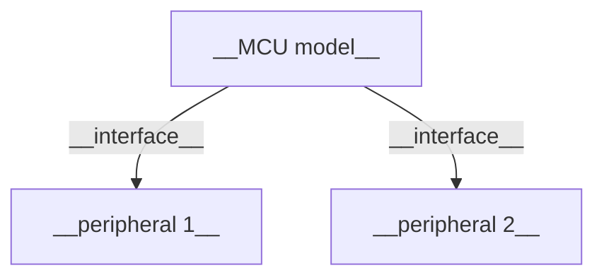
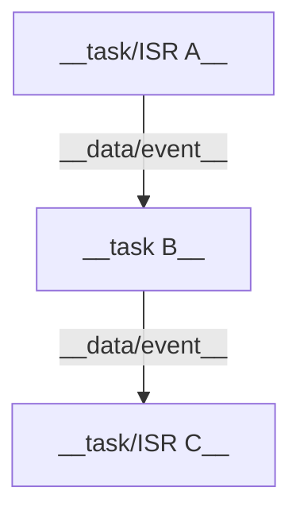
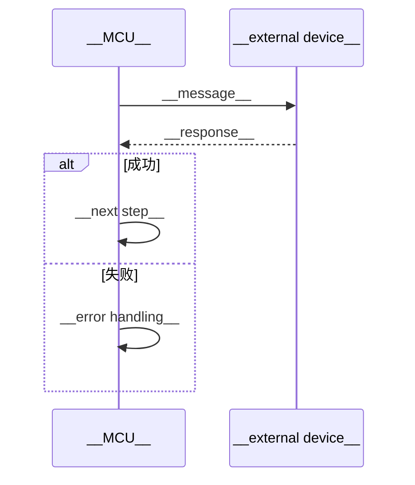
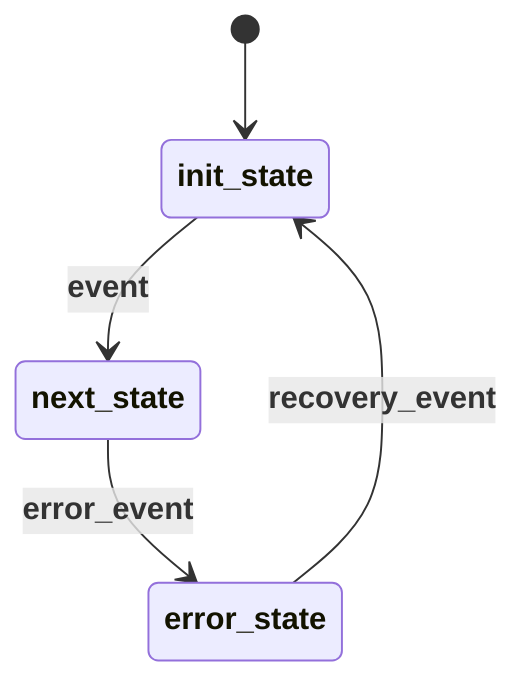
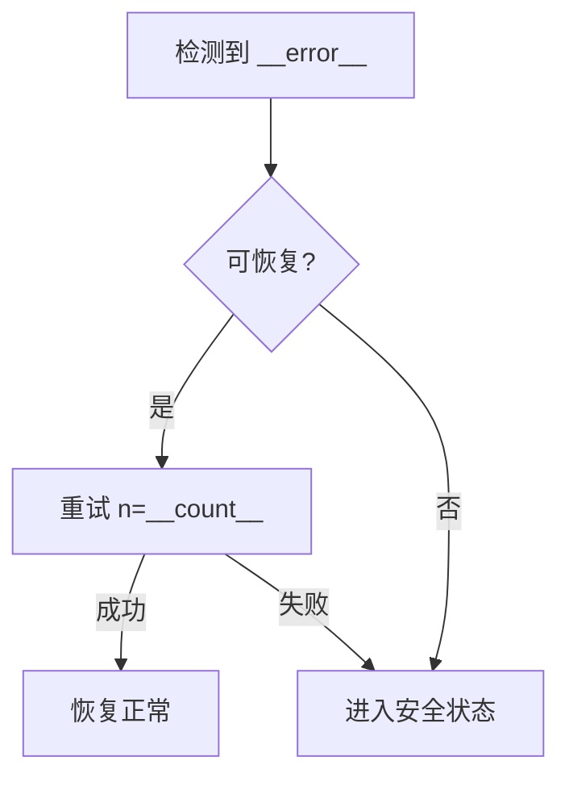

# {{TITLE}} — 嵌入式软件设计

> **版本**: {{VERSION}} | **作者**: {{AUTHOR}} | **日期**: {{DATE}} | **状态**: {{STATUS}}

## 1. 概述

### 1.1 目标

{{2-3 sentences: what this embedded software does, key goals}}

### 1.2 范围

**在范围内:**
- {{item}}

**不在范围内:**
- {{item}}

### 1.3 术语

| 术语 | 定义 |
|------|------|
| {{term}} | {{definition}} |

### 1.4 参考文档

| 文档 | 类型 | 来源 | 说明 |
|------|------|------|------|
| {{name}} | {{HLD/LLD/Datasheet/Ref}} | {{path or URL}} | {{relevance}} |

## 2. 系统架构

### 2.1 硬件框图



| 外设/器件 | 型号 | 接口 | 引脚 | 用途 |
|-----------|------|------|------|------|
| {{name}} | {{model}} | {{UART/I2C/SPI/GPIO}} | {{pins}} | {{purpose}} |

### 2.2 软件架构



### 2.3 组件职责

| 组件/任务 | 类型 | 优先级 | 栈大小 | 职责 | 依赖 |
|-----------|------|--------|--------|------|------|
| {{name}} | {{task/ISR}} | {{priority}} | {{bytes}} | {{one-line}} | {{dependencies}} |

## 3. 接口设计

### 3.1 外部接口

| 接口 | 类型 | 物理层 | 协议 | 方向 | 速率 |
|------|------|--------|------|------|------|
| {{name}} | {{UART/I2C/SPI/BLE/etc.}} | {{physical}} | {{protocol}} | MCU↔{{device}} | {{bps}} |

**{{interface name}} 消息定义:**

| 消息 | 方向 | 触发条件 | 数据格式 | 频率 |
|------|------|----------|----------|------|
| {{message}} | MCU→{{dev}} | {{when}} | {{format}} | {{Hz}} |

### 3.2 内部接口

| 接口 | 类型 | 发送方 | 接收方 | 数据载荷 | 同步机制 |
|------|------|--------|--------|----------|----------|
| {{name}} | {{queue/mailbox/event}} | {{sender}} | {{receiver}} | {{payload}} | {{mutex/semaphore}} |

### 3.3 关键函数接口

```c
/**
 * {{brief}}
 * @param {{name}}  {{description, range, constraints}}
 * @return {{description, error codes}}
 */
{{return_type}} {{function_name}}({{params}});
```

### 3.4 数据结构

```c
// {{structure name}} — {{purpose}}
typedef struct {
    {{type}} {{field}};  // {{description, valid range}}
} {{name}};
```

### 3.5 配置参数

| 参数 | 类型 | 默认值 | 范围 | 说明 |
|------|------|--------|------|------|
| {{name}} | {{type}} | {{default}} | {{min–max}} | {{description}} |

## 4. 核心流程与逻辑

### 4.1 关键流程



### 4.2 状态机



| 状态 | 描述 | 进入动作 | 退出动作 |
|------|------|----------|----------|
| {{state}} | {{meaning}} | {{entry action}} | {{exit action}} |

| 当前状态 | 事件 | 下一状态 | 动作 | 超时 |
|----------|------|----------|------|------|
| {{current}} | {{event}} | {{next}} | {{action}} | {{timeout}} |

### 4.3 核心算法

```c
// {{algorithm name}}
// 时间复杂度: {{O(n)}}  |  空间复杂度: {{O(1)}}
{{pseudocode or key code snippet}}
```

**边界条件:**
- {{edge case 1}} → {{behavior}}
- {{edge case 2}} → {{behavior}}

### 4.4 时序约束

| 操作 | 最坏执行时间 | 截止时间 | 周期 |
|------|-------------|----------|------|
| {{operation}} | {{WCET}} | {{deadline}} | {{period}} |

## 5. 异常处理

### 5.1 错误分类

| 类别 | 示例 | 处理策略 |
|------|------|----------|
| 通信错误 | CRC failure, timeout | {{retry N times, then alert}} |
| 数据错误 | Out-of-range, invalid state | {{log, use default, reject}} |
| 硬件故障 | Sensor dead, short circuit | {{safe state, report}} |
| 资源耗尽 | OOM, queue full | {{backpressure, graceful degradation}} |

### 5.2 错误码表

| 错误码 | 名称 | 触发条件 | 处理方式 | 恢复策略 |
|--------|------|----------|----------|----------|
| {{code}} | {{name}} | {{condition}} | {{handler}} | {{recovery}} |

### 5.3 异常处理流程



### 5.4 看门狗与恢复

- **看门狗策略**: {{hardware/software watchdog, kick interval, timeout}}
- **故障恢复**: {{restart sequence, state restoration}}
- **任务监控**: {{heartbeat mechanism, timeout, action on hang}}
